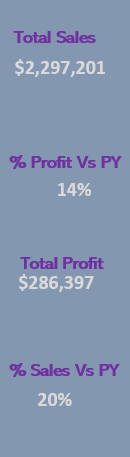
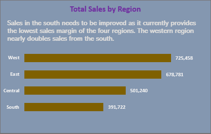
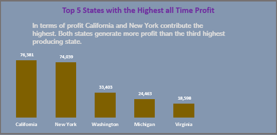
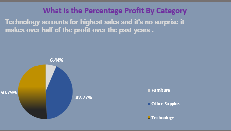
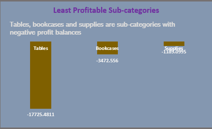
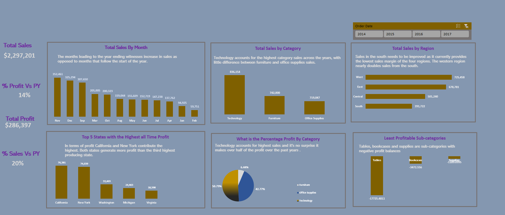

# US Superstore

## Introduction
This is project is to help understand the sales performance of super store company over the years and provide pointers that will help make better informed decisions in the coming year

**_Disclaimer_**: _All dataset does not represent any company, institution or country but a dummy dataset to demonstrate capabilities of Microsoft excel._

## Problem statement
 i).Find out the highest sales month over the last few years
 
 ii). What caegory has the highest sales overtime?
 
 iii). What region makes the most sales overtime?
 
 iv). Top 5 states that generates the most Profit
 
 v). What is the percentage of profit of profit by category?
 
 vi) What are the 3  least profitable sub categories?
 

 ## Key Perfromance Indicator
The following were the KPI that was used in the report 

i).Total Sales

ii).Total Profit

iii). % Sales Vs Pervious Year(PY)

iv). % Profit  Vs Previous Year(PY)

## Skill/ Concepts Demonstrated

The following Microsoft excel skills were incorporated-
-Data filtering

- Sorting Data
  
- Data cleaning

- Pivot Table

- Pivot Chart

  ## Business Questions Visuals 

Chart 1                     |  Chart 2
:------------------------------:|:-----------------------:
                 | 

Chart 3                     |  Chart 4
:------------------------------:|:-----------------------:
                 | 

  ## Pivot Chart Visual
  

 
